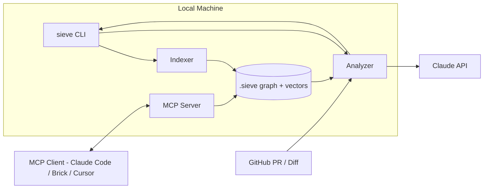
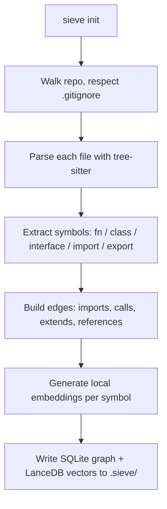
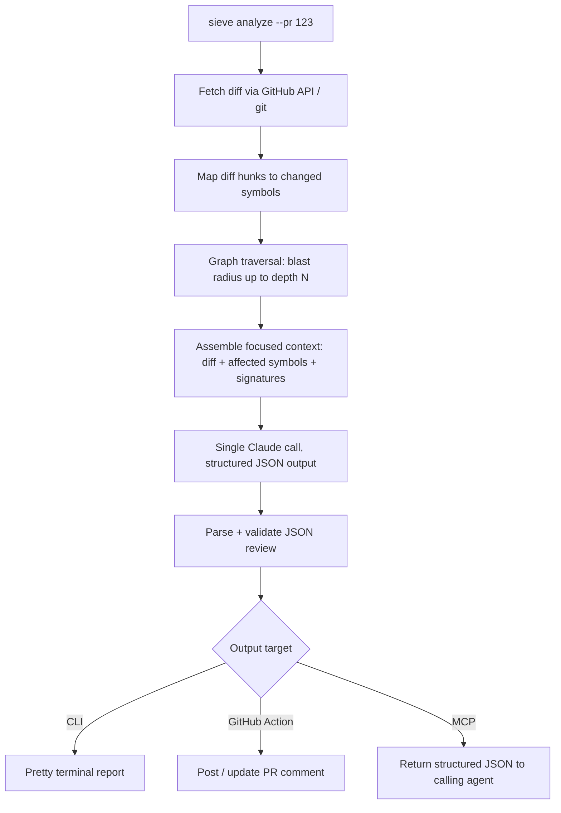

# Project Sieve — Build Spec & Agent Prompt

> Phase 1 of the Brick roadmap: an open-source AI PR analyzer that doubles as the permanent semantic-dependency-map engine Brick's agents will query in later phases.

## How to use this file

Save this **entire document** as `AGENTS.md` (or `CLAUDE.md` / `.cursorrules`, depending on your tool) at the root of a new repo. Agentic coders read these files automatically on startup.

- **Parts 1–8** are context the agent needs once, up front.
- **Part 9** is the literal, sequenced build order — this is what the agent actually executes.
- **Part 10** is for after Milestone 6 (launch).

To kick things off: open Claude Code in the empty repo and say *"Read AGENTS.md, then start Milestone 1."* Re-open a fresh session at the start of each new milestone and say *"Read AGENTS.md, M1–M(n-1) are done, start M(n)."*

---

## Part 1 — Strategic Context

Brick's long-term play is an environment-agnostic agent layer (CLI + VS Code + Antigravity) that beats Cursor/Windsurf/Claude Code on three fronts: transparent token usage, large-monorepo context awareness, and zero editor lock-in.

**Project Sieve is the wedge.** Rather than launching a whole IDE on day one, Sieve ships first as a standalone open-source PR analyzer. Its real job isn't "review my PR" — it's **building a permanent, queryable semantic dependency graph of the codebase**. That graph does double duty:

- It's what makes Sieve's reviews good (it knows the *blast radius* of a change, not just the diff text).
- It's the exact context-mapping engine Brick's agents will query in Phase 2/3 instead of dumping 50 files into a prompt.

Win the PR-reviewer market first → inherit a working dependency graph for free → bolt multi-agent orchestration on top later. No rewrite required.

---

## Part 2 — Product Definition (v1 scope)

### Sieve v1 DOES

1. **Index** a repo — parse source files, extract symbols (functions/classes/types/imports), build a dependency graph, persist it locally.
2. **Analyze a diff/PR** — compute the blast radius of changed code, pull in only that relevant context, and ask Claude for a structured review.
3. **Serve an MCP server** — expose the dependency graph + analyzer as tools any MCP client (Claude Code, Brick, Cursor) can call.
4. **Run as a CLI** (`sieve init`, `sieve analyze`, `sieve query`, `sieve serve`) and as a **GitHub Action** that comments on PRs.

### Sieve v1 does NOT (guardrails — do not build these yet)

- ❌ No auto-fix or code generation — Sieve *reports*, it doesn't *write*.
- ❌ No LangGraph, no multi-agent orchestration, no "coordinator agent" — that's Brick Phase 2, a separate repo.
- ❌ No deployment/DevOps tooling (Vercel, Hostinger, Supabase, etc.) — Brick Phase 3.
- ❌ No cloud-hosted indexing or SaaS backend — everything runs locally.
- ❌ No fine-tuned models — Claude API via the user's own key, full token transparency.

### Differentiation hooks (bake these in from day one)

- **Token transparency** — every `sieve analyze` run prints exact input/output tokens and estimated cost.
- **BYOK by default** — reads `ANTHROPIC_API_KEY` / `GITHUB_TOKEN` from env. No proxy, no markup, no opaque "credit" pools.
- **Local-first** — the dependency graph lives in `.sieve/` inside the repo (SQLite + vectors), gitignored, zero cloud dependency.

---

## Part 3 — Architecture & Workflow

### 3.1 System overview



### 3.2 Indexing workflow (`sieve init`)



### 3.3 PR analysis workflow (`sieve analyze`)



### 3.4 MCP server workflow

An agent connects to `sieve serve` over stdio and gets four tools (Part 7). This is the piece that *becomes* Brick's context-mapping engine later — same process, new client, no rewrite.

---

## Part 4 — Tech Stack

| Layer | Choice | Why |
|---|---|---|
| Language | TypeScript, Node 20+, strict mode | First-class `@modelcontextprotocol/sdk` support; same language as the future VS Code extension and Brick CLI |
| Parsing | `tree-sitter` (via `web-tree-sitter` or native bindings) | Incremental, battle-tested, 40+ language grammars available |
| Graph store | SQLite via `better-sqlite3` | Zero-config, embedded, fast relational queries for the dependency graph |
| Vector store | LanceDB | Embedded, no server process, pairs naturally with SQLite for hybrid search |
| Embeddings | Local model via `@xenova/transformers` (`all-MiniLM-L6-v2`); Voyage AI as an opt-in upgrade | Keeps v1 free/local — "no surprise API bills" is part of the pitch |
| LLM | Anthropic Claude API, model configurable (default Sonnet) | Best code reasoning; BYOK = transparent cost |
| MCP | `@modelcontextprotocol/sdk` | Standard tool-exposure protocol — non-negotiable per the roadmap |
| GitHub | `octokit` | Official client for PR diffs + comments |
| CLI | `commander` | Lightweight, well-documented argument parsing |
| Diff parsing | `parse-diff` (or `diff`) | Turns unified diffs into structured hunks |

**Languages parsed in v1**: TypeScript/JavaScript + Python. Two languages is enough to prove the dependency-graph concept and covers most repos Brick will target. Structure the parser so adding language #3 later means "add one grammar + one query file," not a rewrite.

---

## Part 5 — Repository Structure

```
project-sieve/
├── src/
│   ├── indexer/
│   │   ├── parser.ts          # tree-sitter setup + per-language queries
│   │   ├── graph-builder.ts   # walks ASTs -> symbols + edges
│   │   ├── embeddings.ts       # local embedding generation
│   │   └── store.ts            # SQLite + LanceDB read/write
│   ├── analyzer/
│   │   ├── diff.ts              # diff fetching + hunk parsing
│   │   ├── blast-radius.ts      # depth-limited BFS over edges
│   │   ├── context-builder.ts   # assembles the Claude prompt payload
│   │   └── reviewer.ts          # Claude API call, token accounting, JSON parsing
│   ├── mcp/
│   │   ├── server.ts            # MCP server bootstrap
│   │   └── tools.ts              # tool schemas + handlers
│   ├── cli/
│   │   ├── commands/
│   │   │   ├── init.ts
│   │   │   ├── analyze.ts
│   │   │   ├── query.ts
│   │   │   └── serve.ts
│   │   └── index.ts              # entrypoint, registers commands
│   └── types.ts                  # shared interfaces (Symbol, Edge, Review, etc.)
├── .github/workflows/sieve-pr-review.yml
├── action.yml                     # GitHub Action manifest
├── package.json
├── tsconfig.json
├── LICENSE                        # MIT
├── CONTRIBUTING.md
└── README.md
```

---

## Part 6 — Data Model

```sql
-- .sieve/graph.db

CREATE TABLE files (
  id INTEGER PRIMARY KEY,
  path TEXT UNIQUE NOT NULL,
  language TEXT NOT NULL,
  content_hash TEXT NOT NULL,
  last_indexed_at DATETIME NOT NULL
);

CREATE TABLE symbols (
  id INTEGER PRIMARY KEY,
  file_id INTEGER NOT NULL REFERENCES files(id) ON DELETE CASCADE,
  name TEXT NOT NULL,
  kind TEXT NOT NULL,        -- 'function' | 'class' | 'interface' | 'variable' | 'type'
  start_line INTEGER NOT NULL,
  end_line INTEGER NOT NULL,
  signature TEXT
);

CREATE TABLE edges (
  id INTEGER PRIMARY KEY,
  from_symbol_id INTEGER NOT NULL REFERENCES symbols(id) ON DELETE CASCADE,
  to_symbol_id INTEGER NOT NULL REFERENCES symbols(id) ON DELETE CASCADE,
  edge_type TEXT NOT NULL    -- 'imports' | 'calls' | 'extends' | 'implements' | 'references'
);

CREATE INDEX idx_edges_to ON edges(to_symbol_id);
CREATE INDEX idx_edges_from ON edges(from_symbol_id);
CREATE INDEX idx_symbols_file ON symbols(file_id);
```

LanceDB table `symbol_vectors`: one row per symbol — `{ symbol_id, embedding, summary_text }`. Used by `search_codebase`.

---

## Part 7 — MCP Tool Contracts (v1)

> Implement with Zod schemas as required by `@modelcontextprotocol/sdk`. The shapes below describe the contract; translate directly.

```typescript
interface SieveTools {
  get_blast_radius: {
    input: { file: string; symbol?: string; depth?: number /* default 2 */ };
    output: { affected: Array<{ file: string; symbol: string; relation: string; distance: number }> };
  };

  search_codebase: {
    input: { query: string; top_k?: number /* default 8 */ };
    output: { results: Array<{ file: string; symbol: string; score: number; snippet: string }> };
  };

  analyze_diff: {
    input: { diff: string; base_ref?: string; head_ref?: string };
    output: {
      summary: string;
      risk_level: "low" | "medium" | "high";
      breaking_changes: string[];
      blast_radius: Array<{ file: string; reason: string }>;
      suggestions: string[];
      tokens_used: { input: number; output: number; estimated_cost_usd: number };
    };
  };

  get_dependency_graph: {
    input: { path_filter?: string; format?: "json" | "mermaid" };
    output: { graph: string };
  };
}
```

---

## Part 8 — Build Roadmap

| Milestone | Scope | Exit criteria |
|---|---|---|
| **M1 — Core Indexer** | tree-sitter for TS/JS + Python, symbol extraction, dependency graph, SQLite store, `sieve init` | `sieve init` on a real repo produces a populated `.sieve/graph.db` with correct files/symbols/edges |
| **M2 — Blast Radius + Local Search** | BFS traversal, LanceDB embeddings, `sieve query` | Querying a changed file returns a correct, depth-limited list of dependents |
| **M3 — Diff Analyzer** | diff parsing, context builder, Claude API call with token accounting, `sieve analyze --diff` | Output is a structured review with accurate token/cost numbers, informed by real blast-radius data |
| **M4 — MCP Server** | `sieve serve`, all four tools from Part 7 | Claude Code (or MCP inspector) connects and successfully calls each tool |
| **M5 — GitHub Action** | `action.yml`, workflow, PR comment formatting via Octokit, `--pr` mode | Opening a test PR on a sample repo gets an automatic Sieve review comment |
| **M6 — OSS Launch** | README, CONTRIBUTING, LICENSE (MIT), demo, npm publish | `npx project-sieve init` works from a clean install |

Build strictly in this order. Do not start M3 before M1/M2 work end-to-end — the entire pitch is that the review is *informed by the graph*, not a bare diff dumped to Claude.

---

## Part 9 — Build Order & Agent Instructions

### Hard constraints — read before writing any code

- TypeScript, Node 20+, strict mode (`"strict": true` in `tsconfig.json`).
- No cloud backend. Everything persists to `.sieve/` inside the user's repo (SQLite via `better-sqlite3` + LanceDB).
- Embeddings are local by default (`@xenova/transformers`, `all-MiniLM-L6-v2`). Do not call any embedding API unless the user explicitly configures one in `sieve.config.json`.
- The only network calls allowed: (a) Anthropic API for review generation, (b) GitHub API for PR diffs/comments — both opt-in, both key-driven. Read keys from env vars (`ANTHROPIC_API_KEY`, `GITHUB_TOKEN`); never hardcode.
- Every Claude API call must log input tokens, output tokens, and an estimated USD cost to stdout. This is a core differentiator — do not skip it, even in early milestones. Keep the per-token price table in a small, easily-updatable config object.
- Keep CLI output as structured data with a separate pretty-printer, so a richer TUI (Ink) can wrap it later without touching core logic.
- Write unit tests for: graph-builder (fixture repo → correct symbols/edges), blast-radius (correct traversal on a known graph), context-builder (correct token-budget enforcement).

### Milestone 1: Core Indexer

1. Scaffold the repo per Part 5. `package.json`, `tsconfig.json` (strict), `src/cli/index.ts` using `commander` with a stub `init` command.
2. `src/indexer/parser.ts` — load tree-sitter grammars for TS/JS and Python; parse each file to an AST.
3. `src/indexer/graph-builder.ts` — walk the AST and extract:
   - **Symbols**: top-level functions, classes, interfaces/types, with line ranges + signatures.
   - **Edges**: `imports` (from import/require statements), `calls` (call expressions resolved to a known symbol where possible), `extends`/`implements` (inheritance).
4. `src/indexer/store.ts` — create the SQLite schema from Part 6; write files/symbols/edges.
5. Wire up `sieve init`: walk the repo (respect `.gitignore` via the `ignore` package), parse every matching file, build the graph, write `.sieve/graph.db`. Print a summary: files indexed, symbols found, edges found, time taken.
6. Tests: a small fixture project (4–5 files with clear import/call relationships); assert the resulting graph has the expected symbols and edges.

**Done when**: `sieve init` on this repo's own source produces a `.sieve/graph.db` where the `edges` table contains real `imports`/`calls` relationships between `src/cli/index.ts` and the command files.

### Milestone 2: Blast Radius + Local Search

1. `src/indexer/embeddings.ts` — for each symbol, build a short text summary (name + kind + signature + nearby comment) and embed it locally.
2. Store embeddings in LanceDB table `symbol_vectors`.
3. `src/analyzer/blast-radius.ts` — depth-limited BFS over `edges` in the *reverse* direction (find everything that points TO a symbol/file), default depth 2, configurable.
4. `sieve query <file> [--symbol name] [--depth n]` — prints the blast radius as a tree.
5. `sieve search "<text>"` — semantic search over `symbol_vectors`, prints top matches with `file:line`.

**Done when**: changing a function in the fixture project and running `sieve query` on it correctly lists every fixture file that calls or imports it — and nothing else.

### Milestone 3: Diff Analyzer

1. `src/analyzer/diff.ts` — accept a local diff (`git diff`) or a GitHub PR number (Octokit); parse into structured hunks (file, line ranges, added/removed lines).
2. For each changed symbol in the diff, look it up in the graph and compute its blast radius (M2).
3. `src/analyzer/context-builder.ts` — assemble one prompt: the diff itself, signatures + one-line summaries of every symbol in the blast radius (not full file contents), plus explicit instructions for JSON output matching `analyze_diff`'s shape from Part 7.
4. `src/analyzer/reviewer.ts` — call the Anthropic API for JSON-only output; parse and validate against the expected shape; log token usage and estimated cost.
5. `sieve analyze --diff` (local) and `sieve analyze --pr <number>` (GitHub): print a formatted terminal report — summary, risk level, breaking changes, suggestions, token/cost line.

**Done when**: running `sieve analyze --diff` against a deliberately breaking change in the fixture project (e.g. renaming an exported function used elsewhere) correctly flags it as breaking and lists the *real* call sites from the blast radius — not a generic LLM guess.

### Milestone 4: MCP Server

1. `src/mcp/tools.ts` — implement the four tools from Part 7, each calling directly into the M1–M3 modules (same process, no HTTP).
2. `src/mcp/server.ts` — bootstrap an MCP server over stdio with `@modelcontextprotocol/sdk`, registering the tools with the exact schemas from Part 7.
3. `sieve serve` — starts the server. Document a sample `mcp.json` snippet in the README for registering it with Claude Code / Claude Desktop.

**Done when**: connecting via the MCP inspector (or Claude Code) and calling `get_blast_radius` on a real symbol in this repo returns correct results.

### Milestone 5: GitHub Action

1. `action.yml` — install Node + Sieve, run `sieve init` (or restore a cached `.sieve/`), then `sieve analyze --pr ${{ github.event.pull_request.number }}`.
2. `.github/workflows/sieve-pr-review.yml` — example workflow triggered on `pull_request`, demonstrated on this repo itself.
3. PR comment formatting — turn the `analyze_diff` JSON into a readable Markdown comment (summary, risk badge, breaking-changes list, blast-radius table, token/cost footer); update the existing comment on re-runs instead of spamming new ones.

**Done when**: opening a PR against this repo that changes an exported function triggers an automatic review comment with accurate blast-radius info.

### Milestone 6: OSS Launch Prep

1. README following Part 10's checklist.
2. `LICENSE` (MIT), `CONTRIBUTING.md` (explain the tree-sitter query-file pattern for adding new languages), `CODE_OF_CONDUCT.md`.
3. Prepare `npm publish` as `project-sieve`; verify `npx project-sieve init` works in a throwaway repo.

### When you're unsure

Default to: the simplest thing that keeps the dependency graph *correct* and the token/cost reporting *honest*. Those two properties are the whole product — everything else is implementation detail.

---

## Part 10 — OSS Launch Checklist

- [ ] MIT license
- [ ] README: problem statement, demo (gif or asciinema), quickstart (`npx project-sieve init`), architecture diagram (reuse Part 3.1)
- [ ] CONTRIBUTING.md — flag that the highest-value contribution is new-language support (one tree-sitter grammar + query file)
- [ ] CODE_OF_CONDUCT.md
- [ ] GitHub Action published to the Marketplace
- [ ] npm package published as `project-sieve`
- [ ] Run Sieve against one real, active open-source repo as a public before/after demo
