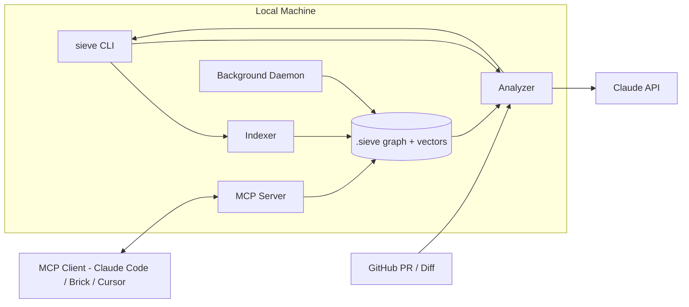

# 🔬 Project Sieve

**AI-powered PR analyzer that knows the *blast radius* of every code change.**

Sieve builds a permanent, queryable semantic dependency graph of your codebase. It doesn't just read your diff — it knows *what depends on what*, catches ghost dependencies from your team's commit history, and gives you a structured review with exact token costs.

> Phase 1 of the Brick roadmap — the open-source wedge that becomes the context engine for multi-agent orchestration.

---

## ✨ Features

### Core
- 🌳 **AST-based dependency graph** — tree-sitter parsing for TypeScript/JavaScript and Python
- 💥 **Blast radius analysis** — depth-limited BFS finds everything affected by a change
- 🤖 **AI code review** — Claude-powered reviews informed by real dependency data, not just diff text
- 🔍 **Semantic search** — local embeddings for natural-language code search
- 🔌 **MCP server** — expose the graph as tools for Claude Code, Cursor, or any MCP client
- ⚡ **GitHub Action** — automatic PR reviews with formatted comments

### Advanced
- 👻 **Temporal coupling** — detects "ghost dependencies" from git history (files that always change together)
- 💰 **Hard token budgeting** — mathematically guarantees you'll never exceed your token budget
- 🔄 **Background daemon** — pre-computes graph updates on file save for instant CLI responses
- 🧪 **Test scaffolder** — generates boilerplate tests for blast-radius-affected functions

---

## 🚀 Quickstart

```bash
# Install
npm install -g project-sieve

# Index your repo
cd your-project
sieve init

# Query the blast radius of a file
sieve query src/utils.ts --depth 3

# Semantic search
sieve search "database connection handling"

# AI-powered review of your changes
export ANTHROPIC_API_KEY=your-key
sieve analyze --diff

# Review a GitHub PR
export GITHUB_TOKEN=your-token
sieve analyze --pr 42

# Generate test scaffolds for affected code
sieve analyze --diff --test

# Start the background daemon
sieve daemon start

# Start the MCP server
sieve serve
```

---

## 🏗️ Architecture



### How It Works

1. **`sieve init`** — walks your repo, parses every file with tree-sitter, extracts symbols (functions, classes, types) and edges (imports, calls, extends), generates local embeddings, and writes everything to `.sieve/graph.db` (SQLite) + `.sieve/vectors/` (LanceDB).

2. **`sieve analyze`** — takes a diff, maps changed lines to symbols, runs a depth-limited BFS over the graph to find the blast radius, assembles a focused prompt (signatures + summaries, NOT full files), and sends it to Claude for a structured review.

3. **`sieve serve`** — exposes the graph as 4 MCP tools that any AI agent can call: `get_blast_radius`, `search_codebase`, `analyze_diff`, `get_dependency_graph`.

---

## 💰 Token Transparency

Every `sieve analyze` run prints exact token counts and estimated cost:

```
💰 Token Usage
━━━━━━━━━━━━━━━━━━━━━━━━━━━━━━━━━━━━━━━━
   Model:         claude-sonnet-4-20250514
   Input tokens:  3,247
   Output tokens: 891
   Cost:          $0.0231
━━━━━━━━━━━━━━━━━━━━━━━━━━━━━━━━━━━━━━━━
```

Set a hard budget in `sieve.config.json`:

```json
{
  "max_cost_per_review": 0.10
}
```

Sieve will refuse to send the request if it would exceed the budget.

---

## 👻 Temporal Coupling

Sieve doesn't just know your code — it knows your team's habits.

```bash
sieve init --with-history
```

This analyzes your git log to find files that change together ≥80% of the time. These "ghost dependencies" appear in blast radius results even though they have no syntactic relationship.

---

## 🔌 MCP Integration

Add Sieve to your `mcp.json`:

```json
{
  "mcpServers": {
    "sieve": {
      "command": "npx",
      "args": ["project-sieve", "serve"],
      "cwd": "/path/to/your/repo"
    }
  }
}
```

Available tools:
- `get_blast_radius` — find what depends on a file/symbol
- `search_codebase` — semantic search over symbols
- `analyze_diff` — full blast-radius-aware review
- `get_dependency_graph` — export graph as JSON or Mermaid

---

## ⚙️ Configuration

Create `sieve.config.json` in your repo root:

```json
{
  "max_depth": 2,
  "languages": ["typescript", "javascript", "python"],
  "model": "claude-sonnet-4-20250514",
  "max_cost_per_review": 0.10,
  "temporal_coupling_threshold": 0.80,
  "temporal_commit_limit": 500,
  "exclude_patterns": ["node_modules/**", "dist/**"]
}
```

---

## 🤝 Contributing

See [CONTRIBUTING.md](CONTRIBUTING.md). The highest-value contribution is **new language support** — each language is just one tree-sitter grammar + one query file.

## 📄 License

MIT — see [LICENSE](LICENSE).
