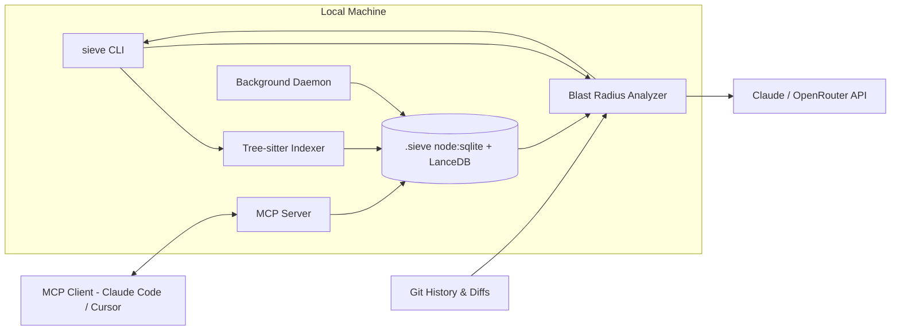

<div align="center">
  <h1>🔬 Project Sieve</h1>
  <p><b>The AI-powered PR analyzer that mathematically guarantees the blast radius of every code change.</b></p>
  <p>
    
    
    
    
  </p>
</div>

<br/>

Sieve builds a permanent, queryable semantic dependency graph of your codebase locally. It doesn't just read your text diff — it knows exactly *what depends on what*, catches logical ghost dependencies from your team's commit history, and writes boilerplate tests for the functions you just broke.

> *Phase 1 of the Brick roadmap — the open-source wedge that becomes the context engine for multi-agent orchestration.*

---

## 🔥 Flagship Features

### 👻 1. Temporal / Historical Coupling (The "Ghost" Dependency)
**The Problem:** AST parsing only maps syntax relationships (e.g., Function A calls Function B). It completely misses logical relationships (e.g., Every time you update the database schema, you also need to update the TypeScript types).
**The Feature:** Sieve hooks into your `git log`. If file A and file B are modified in the same commit ≥80% of the time historically, Sieve creates a "Temporal Edge".
**The Pitch:** *Sieve doesn't just know your code; it knows your team's habits. It catches logical breaks that AST parsers miss.*

### 💰 2. Hard Token Budgeting & Auto-Compression
**The Problem:** On massive enterprise repos, the blast radius of a change can be huge, leading to unexpected API bills when sending context to LLMs.
**The Feature:** Set a strict token budget in `sieve.config.json` (e.g., `max_cost_per_review: $0.10`). If the calculated blast radius exceeds this budget, Sieve automatically triggers a "Compression Pass" using a cheaper model (like Claude 3.5 Haiku) to summarize the files before sending the final payload to the expensive model for the actual review.
**The Pitch:** *The only AI tool that mathematically guarantees you will never exceed your token budget.*

### 🧱 3. Agentic Pre-computation (The Brick Setup)
**The Problem:** Generating local embeddings and AST graphs on the fly for every single symbol is slow and CPU intensive.
**The Feature:** Run Sieve as a persistent background daemon (`sieve daemon start`). Whenever a developer saves a file, Sieve silently updates the AST and vector embeddings in the background. By the time you type `sieve analyze`, the graph is already 100% up to date, making the CLI response effectively instant.

### 🧪 4. The "Blast Radius" Test Scaffolder
**The Problem:** Telling a developer "You broke Function C" is helpful, but it still requires them to go write a test to figure out how it broke.
**The Feature:** Add the `--test` flag. When Sieve analyzes a diff, it uses the AST to extract the signatures of the affected downstream functions and outputs a boilerplate Jest/Vitest test file specifically designed to test the broken edge cases.
**The Pitch:** *Sieve doesn't just point out your bugs; it writes the tests to prove them.*

### 🧠 5. Bring Your Own AI (BYO-AI)
Plug in any model you want. Sieve natively supports Anthropic (Claude), OpenRouter, and any custom OpenAI-compatible API endpoints. Configure your provider, point your API key, and you're ready to go.

---

## 🚀 Quickstart

### Installation
```bash
npm install -g project-sieve
```

### 1. Initialize your repository
```bash
cd your-project
sieve init --with-history
```
*This parses all files using tree-sitter, reads your git log for temporal coupling, and builds the local `.sieve/graph.db` using zero-dependency `node:sqlite`.*

### 2. Run the Background Daemon
```bash
sieve daemon start
```
*Sieve will now watch your files and incrementally update the AST and vector database on every file save.*

### 3. Analyze a Diff & Scaffold Tests
```bash
# Run a blast-radius aware code review and generate tests for affected code
sieve analyze --diff --test
```

### 4. Connect to MCP (Cursor / Claude Desktop)
Add Sieve to your MCP configuration to give your AI agent deep semantic understanding:
```json
{
  "mcpServers": {
    "sieve": {
      "command": "npx",
      "args": ["project-sieve", "serve"],
      "cwd": "/path/to/your/repo"
    }
  }
}
```

---

## ⚙️ Configuration

Sieve is highly configurable. Create a `sieve.config.json` in your repository root:

```json
{
  "max_depth": 2,
  "languages": ["typescript", "javascript", "python"],
  "provider": "openrouter",
  "api_key_env_var": "OPENROUTER_API_KEY",
  "api_base_url": "https://openrouter.ai/api/v1/chat/completions",
  "model": "anthropic/claude-3.5-sonnet",
  "max_cost_per_review": 0.10,
  "temporal_coupling_threshold": 0.80,
  "temporal_commit_limit": 500,
  "exclude_patterns": ["node_modules/**", "dist/**", ".sieve/**"]
}
```

---

## 🏗️ Architecture



---

## 🤝 Contributing

See [CONTRIBUTING.md](CONTRIBUTING.md). The highest-value contribution is **new language support** — each language requires just one tree-sitter grammar and one query extraction mapping!

## 📄 License

MIT — see [LICENSE](LICENSE).
