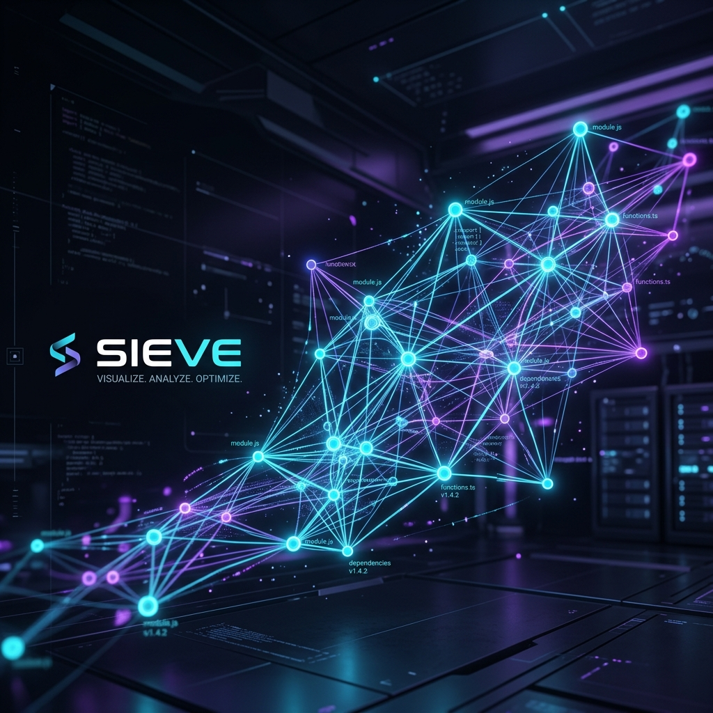
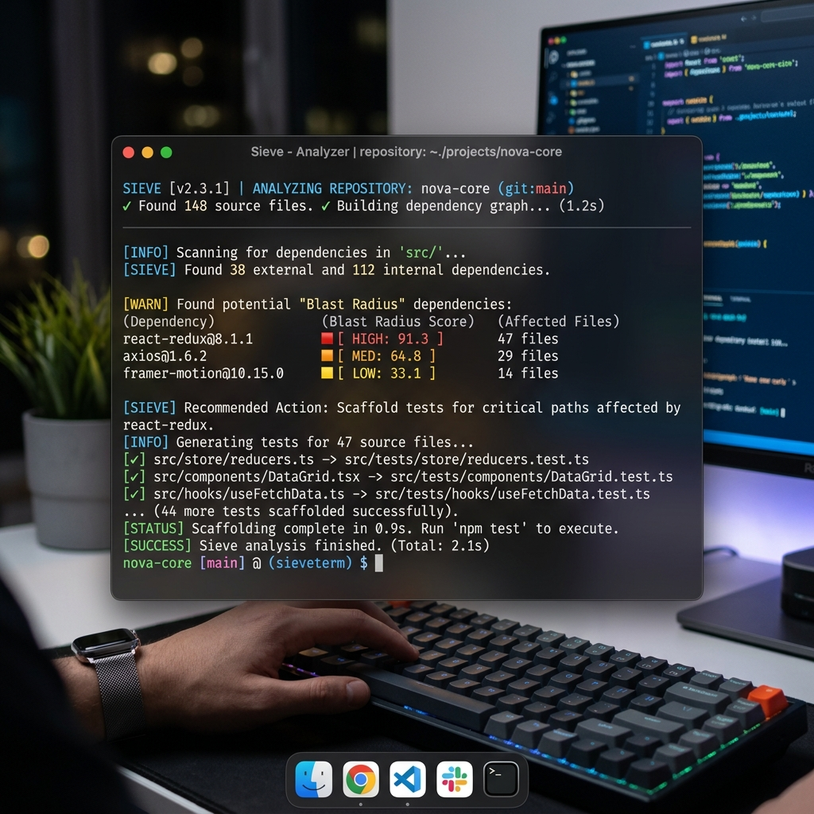

<div align="center">
  
  
  <h1>🔬 Project Sieve</h1>
  <p><b>The AI-powered PR analyzer that mathematically guarantees the blast radius of every code change.</b></p>
  <p>
    
    
    
    
  </p>
</div>

---

## 🌟 What is Sieve?

**Project Sieve** is an open-source, local-first code analysis engine that reads your codebase the way a senior engineer does. 

Instead of just looking at raw text diffs, Sieve builds a permanent, queryable semantic dependency graph of your codebase. When you submit a PR or make a change, Sieve doesn't just read the changed lines—it knows exactly **what depends on what**. It traces the execution path, catches logical "ghost dependencies" from your team's commit history, and writes boilerplate tests for the functions you just broke.

<div align="center">
  
  <p><i>Sieve computing blast radius dependencies and analyzing PRs locally.</i></p>
</div>

---

## 💡 The Problem It Solves

Modern LLM coding tools suffer from two massive problems:
1. **Blind Spots:** They look at isolated files or simple text diffs. They don't realize that changing a database schema in `schema.py` might silently break a frontend type definition in `types.ts`.
2. **Context Bloat & Insane Costs:** To give an AI enough context to review code properly, developers often dump massive amounts of files into the prompt. This leads to massive API bills and lost LLM reasoning due to noise.

**Sieve solves this by introducing "Blast Radius Awareness".**
By building a local SQLite AST (Abstract Syntax Tree) database, Sieve intercepts your diffs, traverses the graph to find *only* the downstream functions impacted by your changes, and sends precisely the exact context needed. **Maximum accuracy. Minimum token cost.**

---

## 🔥 How It Works (Flagship Features)

### 👻 1. Temporal / Historical Coupling (The "Ghost" Dependency)
AST parsing only maps syntax relationships (e.g., Function A calls Function B). It completely misses logical relationships. Sieve hooks into your `git log`. If file A and file B are modified in the same commit ≥80% of the time historically, Sieve creates a "Temporal Edge". It catches logical breaks that traditional AST parsers miss entirely.

### 💰 2. Hard Token Budgeting & Auto-Compression
Set a strict token budget in `sieve.config.json` (e.g., `max_cost_per_review: $0.10`). If the calculated blast radius exceeds this budget, Sieve automatically triggers a "Compression Pass" using a cheaper model (like Claude 3.5 Haiku) to summarize the files before sending the final payload to the expensive model for the actual review. **You will never exceed your token budget.**

### ⚡ 3. Agentic Pre-computation (Background Daemon)
Generating local embeddings and AST graphs on the fly is slow. Run Sieve as a persistent background daemon (`sieve daemon start`). Whenever you save a file, Sieve silently updates the AST and vector embeddings in the background. By the time you type `sieve analyze`, the graph is already 100% up to date.

### 🧪 4. The "Blast Radius" Test Scaffolder
Sieve doesn't just point out your bugs; it writes the tests to prove them. By adding the `--test` flag, Sieve uses its graph to extract the signatures of affected downstream functions and automatically outputs boilerplate Jest/Vitest test files designed to test the broken edge cases.

### 🧠 5. Bring Your Own AI (BYO-AI)
Plug in any model you want. Sieve natively supports Anthropic (Claude), OpenRouter, and any custom OpenAI-compatible API endpoints. 

---

## 🚀 Installation & Quickstart

### 1. Install Globally
```bash
npm install -g project-sieve
```

### 2. Initialize your repository
Navigate to your project folder and initialize Sieve. This parses all files, reads your git log for temporal coupling, and builds the local `.sieve/graph.db` using a zero-dependency local SQLite instance.
```bash
cd your-project
sieve init --with-history
```

### 3. Run the Background Daemon
Keep your graph instantly updated while you code.
```bash
sieve daemon start
```

### 4. Analyze a Diff & Scaffold Tests
Run a blast-radius-aware code review against your unstaged changes and generate tests.
```bash
sieve analyze --diff --test
```

### 5. (Optional) Connect to MCP Clients
Add Sieve to your MCP configuration (Cursor, Claude Desktop, etc.) to give your AI agent deep semantic understanding:
```json
{
  "mcpServers": {
    "sieve": {
      "command": "npx",
      "args": ["project-sieve", "serve"],
      "cwd": "/path/to/your/repo"
    }
  }
}
```

---

## ⚙️ Configuration

Create a `sieve.config.json` in your repository root to tweak the behavior to your liking:

```json
{
  "max_depth": 2,
  "languages": ["typescript", "javascript", "python"],
  "provider": "openrouter",
  "api_key_env_var": "OPENROUTER_API_KEY",
  "api_base_url": "https://openrouter.ai/api/v1/chat/completions",
  "model": "anthropic/claude-3.5-sonnet",
  "max_cost_per_review": 0.10,
  "temporal_coupling_threshold": 0.80,
  "temporal_commit_limit": 500,
  "exclude_patterns": ["node_modules/**", "dist/**", ".sieve/**"]
}
```

---

## 🤝 Contributing

We welcome contributions! Sieve is built entirely in TypeScript and relies on `web-tree-sitter` for parsing.

### How to Contribute
1. **Fork the repository** and clone it locally.
2. Run `npm install` to install dependencies.
3. Run `npm run build` to compile the TypeScript.
4. **The Highest-Value Contribution: New Language Support!** Each new language only requires one tree-sitter grammar and one query extraction mapping in `src/indexer/parser.ts`.

Please read our [CONTRIBUTING.md](CONTRIBUTING.md) for detailed instructions on submitting Pull Requests. Be sure to review our [Code of Conduct](CODE_OF_CONDUCT.md).

---

## 📄 License

Sieve is released under the MIT License. See [LICENSE](LICENSE) for details.
